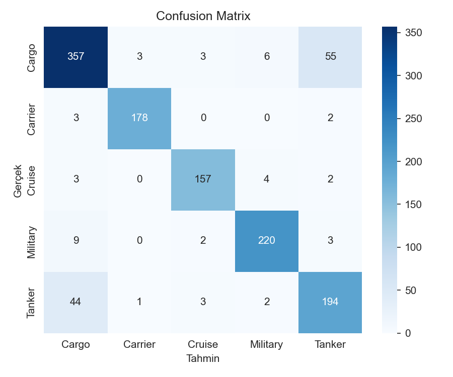

# Ship Image Classification using EfficientNetB0

## Overview
This project classifies ship images into five categories (Cargo, Military, Carrier, Cruise, Tanker) using deep learning and transfer learning with EfficientNetB0.  
Developed by **Celil Berk Çoban** as part of the graduate course *Deep Learning*.

## Dataset
Kaggle: Game of Deep Learning – Ship Dataset  
Download dataset locally and place images under `data/images/`, and `train.csv` under `data/` (not included in the repo).

## Model
- EfficientNetB0 (ImageNet weights, include_top=False)
- Input: 224×224
- Optimizer: Adam (lr=1e-3), Loss: Categorical Crossentropy
- Epochs: 25
- Callbacks: EarlyStopping, ModelCheckpoint (.keras)

## Results
- Validation Accuracy ≈ **0.884**
- Macro ROC-AUC ≈ **0.984**

### Confusion Matrix


## How to Run
```bash
pip install -r requirements.txt
# open the notebook
jupyter notebook notebooks/GemiTürüSiniflandirmaProjesi_Odev.ipynb
